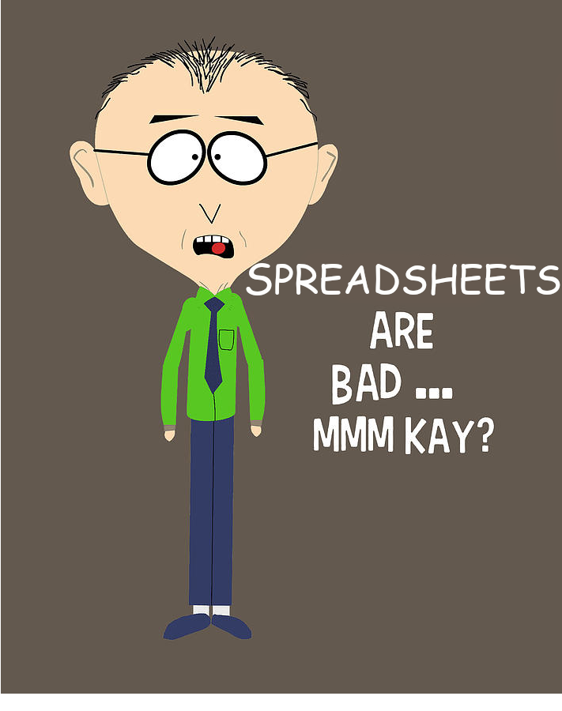

# CIT 225 Lesson 1
# High Level Overiew of Databases
---
# Who has ever used a database?
---
# Who has ever used a database? (continued)
- If you didn't raise your hand you should have.
- Databases are everywhere whether you know it or not
    - If you have a bank account, social media accounts or use Amazon, you're using databases on a daily bases.
    - Databases are one of the core building blocks of most of our modern technology.
---
# Data vs. Information
**Data** - Raw facts, or facts that have not yet been processed to reveal their meaning to the end user.

**Information** - The result of processing raw data to reveal its meaning. Information consists of transformed data and facilitates decision making.

---
# Data vs. Information an Example
Let's use our bank accounts as an example:

The debits and deposits to your bank account would be *data*.

| Transaction Date    | Transaction Amount |Transaction Description   |
| -------------------| ------------------ | ------------------------- |
| 2025-01-01         | -$25.00             | Habitat for Huge Manitees|
| 2025-01-01         | -$80.38             | Paddy's Pub              |
| 2025-01-02         | -$19.99             | Prawn Hub                |
| 2025-01-03         | +$1,200.76          | Direct Deposit           |

---
# Data vs. Information an Example (continued)
The budgeting tools offered by your bank would be *information*. 
| Total Monthly Expenditure    | Category           | Percent |
| -----------------------------| ------------------ | ------- |
| $170                         | Bars & Restaurants |  10%    |
| $340                         | Groceries          |  20%    |
| $1700                        | Rent               |  50%    |

 Your monthy bank statement listing the total debits and deposits could also be considered information.
| Starting Balance | Ending Balance | Total Deposits | Total Debits |
| ---------------- | -------------- | -------------- | ------------ |
| $3,500.27        | $2,624.31      |  $2,401.52     | $3,277.52    |

---

# What is a database?
A shared, integrated computer structure that houses a collection of related data. A database contains two types of data: end-user data (raw facts) and metadata.

- Typically it's the third tier of the traditional three-tier architecture that consists of the presentation tier (user interface), the logical/application tier and the data tier.
---
# [Relational] Database Management System ([R]DBMS)
The collection of programs that manages the database structure and controls access to the data stored in the database.
- Simply put, it's the translation layer between an end user request (input) and returned result (output). The majority of this is hidden from your view.

---
## Examples of RDBMS'
#### Propietary Software
- Microsoft SQL Server
- MySQL
- IBM DB2 
- Google BigQuery
#### Free Open Source Software (FOSS)
- SQLite
- Postgres
- MariaDB
- DuckDB
---
## Types of Datbases
- **Operational or Transactional Database (OLTP)**
    - Typically the backend of a production system.
    - Optimized for real-time, concurrent data capture.
    - Think of this as where the raw data is stored.
- **Analytical Database (OLAP)**
    - May also be known as a data warehouse, data lake, etc.
    - Optimized for analytics and business intelligence.
    - Think of this as where the information is stored.
---
## Structured vs. Unstructured Data
**Unstructured Data** - Data that exists in its original, raw state; that is, in the format in which it was collected.
**Semistructured Data** - Data that has already been processed to some extent.
**Structured Data** - Data that has been formatted to facilitate storage, use, and information generation.

---
## Structured vs. Unstructured Data Examples
**Unstructured Data** - PDFs, word documents, images, audio files, etc.
**Semistructured Data** - XML, JSON, HTML, YAML, Spreadsheets, etc.
**Structured Data** - Relational Databases
---
# A spreadsheet is not a database
- Now or in the future you might have co-workers say "let me share this database with you" and they email or slack you an .xlsx file or a share a google sheet.

- **Question: Why might a spreadsheet be a poor choice for long-term data storage?**

---
# A few reasons why databases are better
 - Security and access control
 - Persistence (more on this down the road)
 - Reduction of Data Inconsistenies
 - Redundancy
 - History
 - Metadata
 - Atomicity, Consistency, Isolation, and Durability aka ACID (more on this down the road too)
---


---
## Metadata
- Defined as data about data.
- Data such as data type, length (if applicable), precision (if applicable),relationships, constraints, etc.
- Metadata is fundamental to how a DBMS works.

---
# Databases and Data Types
- We'll discuss dive into how to choose data types when we talk about data modelling.
- Data types (especially properly chosen ones) are essential to building a database.

---
## Numeric Data Types
- Integers (INT, BIGINT, SMALLINT)
    - 10, 100000, 1
- Fixed Point Numbers (DECIMAL, NUMERIC)
    - 1.2
- Floating Point Number (FLOAT, DOUBLE)
    - 3.1415
---
## Text Data Types
VARCHAR, NVARCHAR and TEXT
- "I'm always going to use nvarchar(max), because I cannot anticipate the length of the data" 
---
## Dates and Times
- Date (DATE): 2025-01-01
- Datetime (DATETIME): 2025-01-01T00:00:00Z
- Timestamps (TIMESTAMP): 2025-01-01T00:00:00Z
---
## Spatial Data Types
- Geometry: 'LINESTRING (100 100, 20 180, 180 180)'
- Geography: 'POLYGON((-122.358 47.653 , -122.348 47.649, -122.348 47.658, -122.358 47.658, -122.358 47.653))'

---
## JSON Data
```
{  
    "student": {  
                "first_name": "Hugh", 
                ,"last_name": "Jass"
                ,"id": 199199,   
                ,"active": true  
    }  
}  
```
---
## XML Data
```
<?xml version="1.0" encoding="UTF-8"?>
<note>
  <to>The World</to>
  <from>Dan</from>
  <heading>XMHell</heading>
  <body>XML makes me sad whenever I see it.</body>
</note>
```
---
# NULLs Matter
While NULLs themseleves are not a datatype, they are 
NULL != ''
NULL != ' '
NULL != 0

---
# Data Management
- Data management is a shared responsible between business and technology teams.
- Your goal as a technologist is to use a database the right way in order to mitigate some of the common problems that arise in data management.
---
## Structural In/dependence
**Structural Dependence** - A data characteristic in which a change in the database schema affects data access, thus requiring changes in all access programs.

**Structural Independence** - A data characteristic in which changes in the database schema do not affect data access.

---
## Data In/dependence
**Data Dependence** - A data condition in which data representation and manipulation are dependent on the physical data storage characteristics.

**Data Independence** - A condition in which data access is unaffected by changes in the physical data storage characteristics.

---
##
**Logical Data Format** - How we view and interpret data within a given context.
**Physical Data Format** - How a computer is storing the data.

---
## Structured Query Language (SQL)
- Pronounced "sequel" not "squil", "squell"..."S-Q-L" is acceptable, but everyone will know you're a n00b.
- SQL is used to query data from a database, but also used to perform tasks such as creating or altering tables, implementing secuirty or CRUD'ing records.

```
/*This is an example of what a SQL query looks like*/
SELECT *
FROM LANGUAGES
WHERE LOWER(DESCRIPTION) = LOWER('greatest f**king language ever')
```
---
## SQL
**Query** - A question or task asked by an end user of a database in the form of SQL code. A specific request for data manipulation issued by the end user or the application to the DBMS.

**Adhoc Query** - Questions that are more "one off" in nature.

**Query Result Set** - The rows of data that are returned by a query.

Terminology: Columns/Fields and Rows/Records can be used interchangebly.

---

## Homework
- Read Chapters 1 and 2
- Create a Github Account if you don't have one