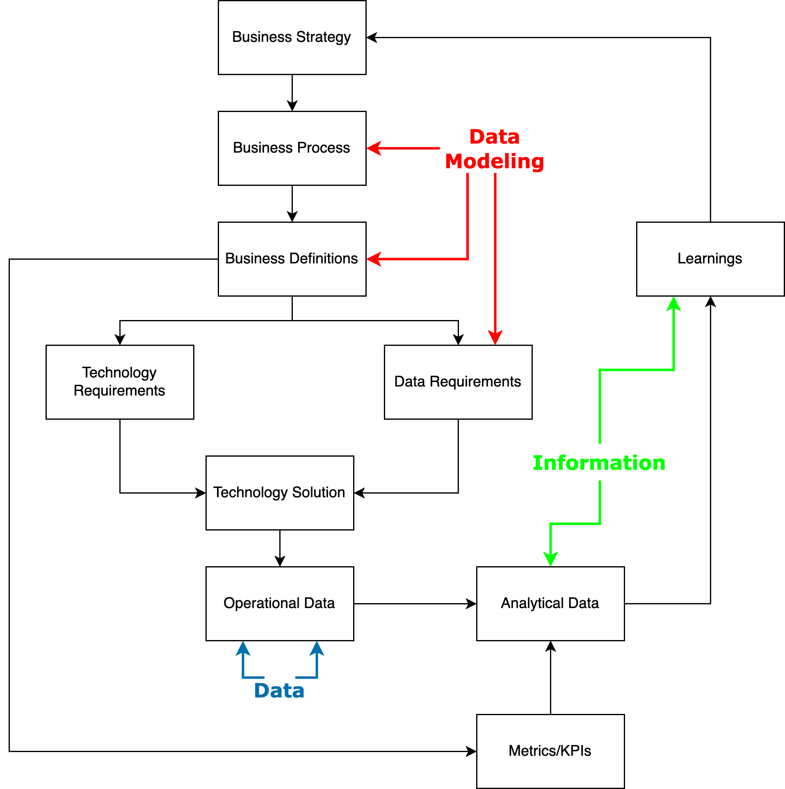

# Lesson 13: Business Intelligence and Data Warehousing

---
## What is a Business Intelligence
- The tools and process that turn data into information to:
    - Generate insights
    - Inform process improvements
    - Drive high-level business/operational decisions
    - Make all of the investment into data worthwhile!
---
### The Data Feedback Loop

---
### BI Capabilities
- ETL, ELT and Reverse ETL Tooling
    - Get our Data into a place to transform it into Information
    - Sometimes get it back to an operational system
- Data Storage (Data Warehouse/Mart)
    - Platforms optimized for data synthesis, aggregation and analytics
    - Querying is a must
- Data Viz Tools
    - Think building charts and dashboards
    - Interactivity is nice, but not required
---
### BI Capabilities (Continued)
- Data Monitoring and Alerting
    - Good businesses are proactive rather than reactive
    - Relies on strong processes and definitions on the business teams
- Data Analytics
    - The basics of "how many customers per time period"
    - To the advanced like "based on the history of customers similar to customer X, what do we predict their purchase history to be?"
---
### Data Governance and Management
- Data Governance
    - Establishes the policies and procedures that control data
- Data Management
    - Enacts the policies and procedures so that data can be used for decision making
---
### KPIs
- Key Performance Indicators (KPIs) are <u>numeric measures</u> used for quantifying and measuring against goals
    - This is a must for a data-driven organization
---
### BI Matters
- No matter the sector that you work in, public or private, BI matters
- It is a discipline that is interoperable even if the context itself is different
---
### Types of Data
- **Operational Data** is highly normalized relational data stored by a database optimized for transactions (Data)
- **Decision Support Data** likely denormalized data that is aggregated and used to inform decision making, stored by a data optimized for aggregation and query processing (Information)

---
### Comparing Operational and Decision Support Data (High-Level)
| Characteristic    | Operational | Decision Support |
|------------------|--------------|------------------|
| Time span        | Short        | Long             |
| Granularity      | High         | High to Low      |
| Dimensionality   | Low          | High             |
---
### Comparing Operational and Decision Support Data (Detailed)
| Characteristic    | Operational  | Decision Support |
|-------------------|--------------|------------------|
| Currency          | Current state, real-time | Prior state snapshot, historic|
| Volatility        | High         | Low              |
| DML Focus         | Insert/Update | Select          |
| Data Model        | Highly normalized, mostly relational | Non-normalized, some relational |
| Query Activity    | Low to Medium | High            |
| Query Complexity  | Low          | High             |
---

### Decision Support Database Requirements
- Offers support for complex, de-normalized schemas
- Supports advanced data extraction (large volumes of data) and filtering (think `WHERE`)
- Enables the storage of big data 
    - At least data that's probably bigger than the operational data
---
### Data Warehouses and Marts
- A **data warehouse** is an integrated, subject-oriented, time-variant, nonvolatile collection of data that provides support for decision making
- A **data mart** is a smaller, single-subject data warehouse catered to a small group of end users
---
### Twelve Rules of a Data Warehouse (1-6)
The data warehouse...
1. is separate from the operational environment
2. data is integrated
3. contains historic data over a long time period
4. data is a snapshot from a given period of time
5. is subject oriented
---
### Twelve Rules of a Data Warehouse (7-12)
The data warehouse...
7. development life-cycle is data driven based on an organizations data needs
8. contains data with several levels of detail
9. is characterized by read-only transactions to large datasets
10. environment has a system that traces data sources, transformation and storage
11. relies on metadata to identify and define all data elements
12. relies on a charge back mechanism to enforce/encourage optimal usage by end users

---
### Star Schemas
- A **star schema** is a data modeling technique used to map multidimensional decisions support data into a relational database
    - Consists of facts, dimensions and attributes
---
### Star Schema Components
- **Facts** are numeric measurements that represent a specific business or operational activity
- **Dimensions** are qualifying characteristics that provide additional perspectives to a given fact
- **Attributes** are descriptive characteristics of dimensions
    - Attribute hierarchies are top-down data organization used for aggregation and drill-down and rollup analyses
---
### Star Schemas Performance Improvement
- Normalization of dimensional tables
- Maintaining multiple fact tables to represent different aggregation levels
- Denormalizing fact tables
- Partitioning and replicating fact tables
---
### Online Analytical Processing (OLAP)
Databases geared towards BI that share three main characteristics
1. Multidimensional data analysis techniques
2. Advanced database support
3. User-interface made for non-technical users
---
### SQL Extensions for OLAP
- Rollup
- Cube
- Materialized Views
---
### Rollup
- Generates aggregates (sum, min, max, avg, etc.) by different dimensions
- Calculates the aggregate for each combination of dimensions, the sub-total for all columns except the last one listed and a grand total
- Usage: `GROUP BY ROLLUP(column1,...,columnn)`
---
### Cube
- Also used to generate aggregates (sum, min, max, avg, etc.) by different dimensions
- Calculate the aggregate for each combination of dimensions, the sub-total for each column and a grand total 
- Usage: `GROUP BY ROLLUP(column1,...,columnn)`
---
### Materialized Views
- Unlike a regular view materialized views are storing data
- Materialized views are dynamic tables that are automatically updated when the underlying tables are updated
- Note that MariaDB doesn't support materialized views
---
### Homework
- Read Chapter 16